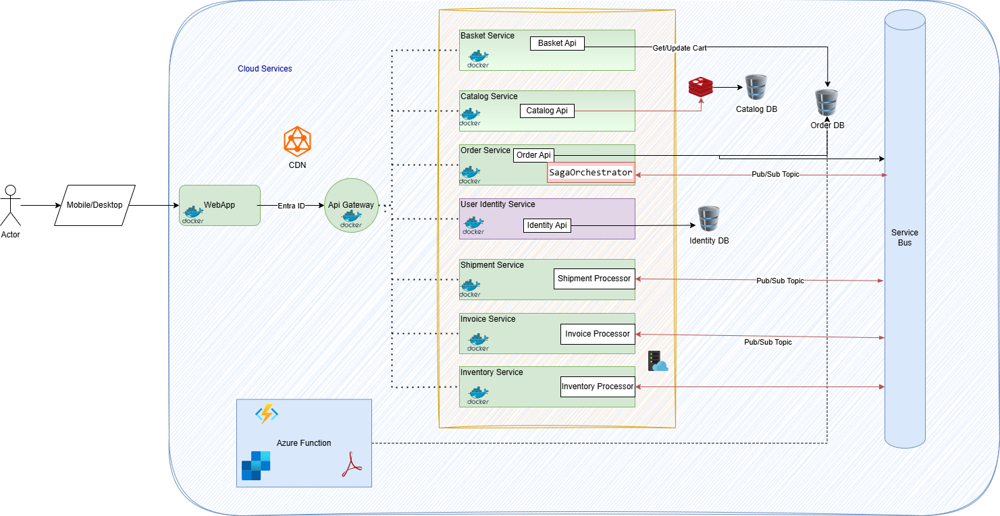
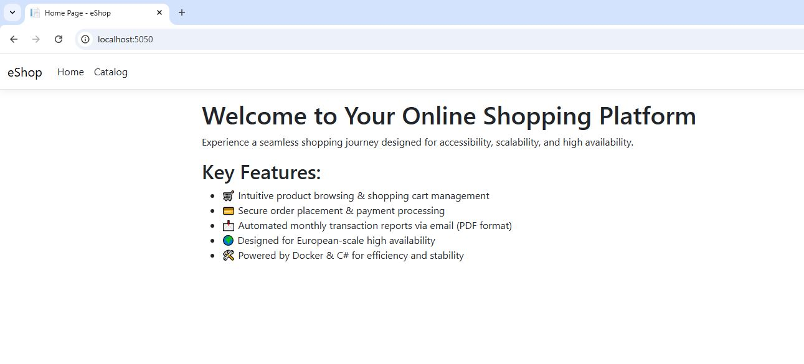

# Cloud-Based Microservices Architecture for E-Commerce

### **Architecture Diagram**
  

## Overview
This project implements a cloud-based **microservices architecture** for an e-commerce application, focusing on:
- **Accessibility** (WCAG compliance, multi-device usability)
- **Quality Assurance** (automated testing, monitoring)
- **High Availability** (load balancing, multi-region deployment)
- **Fault Tolerance** (auto-scaling, disaster recovery)
- **European Scale Readiness** (GDPR compliance, multi-region hosting)

## Architecture Components

### Frontend (**Accessibility & Quality**)
- **Mobile/Desktop Interface**:
  - WCAG-compliant, high-contrast design.
  - Screen-reader optimized for inclusivity.
- **WebApp (Docker-based)**:
  - Responsive design, ensures cross-browser and multi-device compatibility.

### API Gateway (**High Availability & Fault Tolerance**)
- **Traffic Routing**:
  - Load balancing prevents bottlenecks.
  - Failover handling ensures continuity.

### Microservices

#### **Basket Service**
- **Basket API** (**Quality & Fault Tolerance**):
  - Real-time updates with retry logic.
- **Basket Processor** (**European Scale**):
  - Optimized for handling simultaneous baskets across European markets.

#### **Catalog Service**
- **Catalog API** (**Accessibility & High Availability**):
  - Search engine optimized for faster lookups.

#### **Order Service**
- **Order API & Processor** (**Fault Tolerance & High Availability**):
  - Resilient order handling with disaster recovery plans.
  - Supports high-volume transactions across EU regions.

#### **User Identity Service**
- **Identity API** (**Accessibility & European Scale**):
  - Secure authentication via **Multi-Factor Authentication (MFA)**.
  - GDPR-compliant, encrypted user data storage.

#### **Shipment & Invoice Services**
- **Shipment Processor** (**European Scale & Fault Tolerance**):
  - Ensures region-wide delivery optimization.
- **Invoice API** (**Quality & EU Compliance**):
  - VAT calculations and multi-currency support.

### Databases (**Fault Tolerance & High Availability**)
- **Catalog DB & Order DB**:
  - Redundant multi-region deployment.
  - Real-time backup strategies.
- **Identity DB**:
  - GDPR-compliant encryption.

### Communication & Event Handling (**Fault Tolerance & High Availability**)
- **Service Bus**:
  - Asynchronous messaging reduces latency and improves fault tolerance.

### External Components (**Quality & European Scale**)
- **CDN**:
  - Optimized for European-wide fast content delivery.
- **Azure Functions**:
  - Dynamic scaling reduces downtime.

## Deployment Approach
- **Multi-region cloud hosting ensures European-wide accessibility**.
- **Automated testing and monitoring** maintain **high service quality**.
- **Real-time failover mechanisms enhance fault tolerance**.

### WebSite

