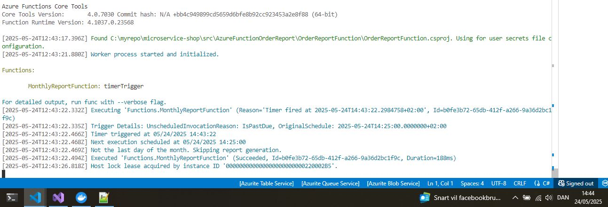

# OrderReportFunction

## Overview

**OrderReportFunction** is an Azure Function designed to run at the **end of each month**. Its purpose is to:

- Retrieve a list of orders with transactions made in the current month from a database or API.
- Each order contains details such as:
  - **Order ID**
  - **Total Price**
  - **VAT**
  - **Total Price including VAT**
  - **Transaction ID**
- Aggregate orders per user to create a monthly report.
- Generate a **PDF report** summarizing each user's orders.
- Send the **PDF report via email** as an attachment.

## Solution Structure

/OrderReportFunction
│
├── Models/
│   ├── Order.cs # Order data model
│   └── UserReport.cs # Aggregated user report model
│
├── Services/
│ ├── Mock/ # Mock implementations for local testing
│ │   ├── MockOrderService.cs
│ │   └── MockEmailService.cs
│ ├── Interfaces/ # Service interfaces
│ │   ├── IOrderService.cs
│ │   ├── IPdfGenerator.cs
│ │   └── IEmailService.cs
│ ├── OrderService.cs # Real implementation for fetching orders
│ ├── PdfGenerator.cs # Real implementation for PDF creation
│ └── EmailService.cs # Real implementation for sending emails
│
├── MonthlyReportFunction.cs # Azure Function trigger and orchestration logic
│
├── local.settings.json # Local config for Azure Functions runtime
└── host.json # Azure Functions host configuration


# Running OrderReportFunction Locally

This guide explains how to run the `OrderReportFunction` Azure Function locally using the Azure Functions Core Tools and .NET SDK.

<<<<<<< HEAD
---
=======
>>>>>>> restructureFolder

## 🚀 Prerequisites

- [.NET SDK](https://dotnet.microsoft.com/download)
- [Node.js & npm](https://nodejs.org/)
- Azure Functions Core Tools (v4)

### Install Azure Functions Core Tools

Use the following command to install Azure Functions Core Tools globally:

```bash
npm install -g azure-functions-core-tools@4 --unsafe-perm true

<<<<<<< HEAD
cd AzureFunctionOrderReport/OrderReportFunction
=======
cd AzFunctionOrderReport/OrderReportFunction
>>>>>>> restructureFolder


dotnet restore

func start
```


  