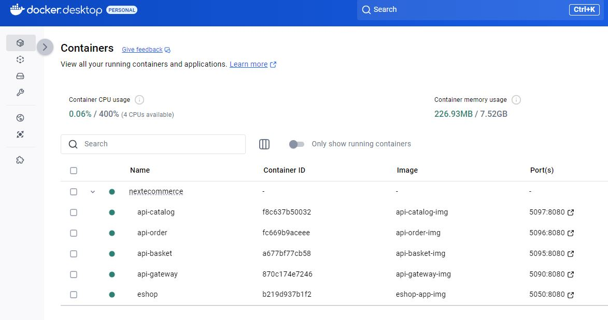

# Next.Ecommerce - Local Setup Guide

## Overview
This guide explains how to set up and run the **Next.Ecommerce** web application and its microservices locally using Docker.

## Prerequisites
Before running the application, ensure the following tools are installed:
- [Docker](https://www.docker.com/get-started)
- [Docker Compose](https://docs.docker.com/compose/install/)

## Getting Started
  

### 1️⃣ Clone the Repository
First, clone the project repository:
```bash
git clone https://github.com/pdc78/microservice-shop.git
cd ./src/Next.Ecommerce/
docker-compose up --build
